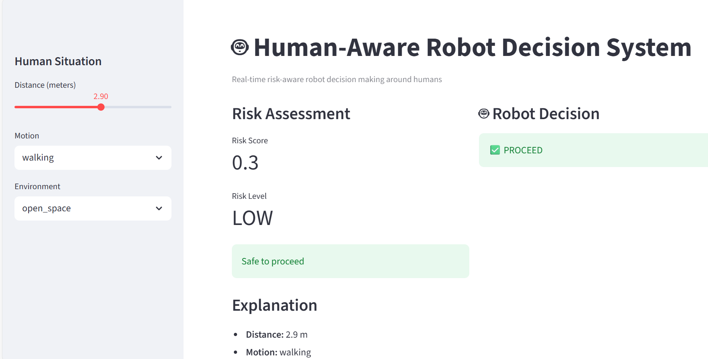
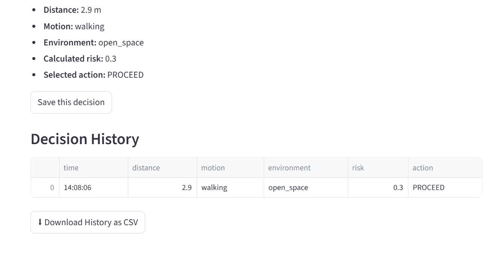

#  Human-Aware Robot Decision System

An AI system that decides when robots should act or wait based on human presence.

## Features
- Human presence dataset
- Risk assessment logic
- Action selection
- End-to-end pipeline
- Interactive Streamlit dashboard

## Demo

### Dashboard


### Decision History


## How to run
```bash
pip install -r requirements.txt
python pipeline.py
streamlit run app/dashboard.py
'''


